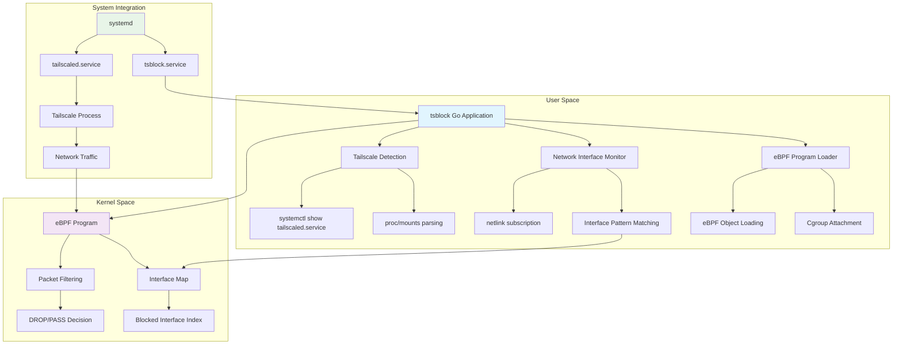
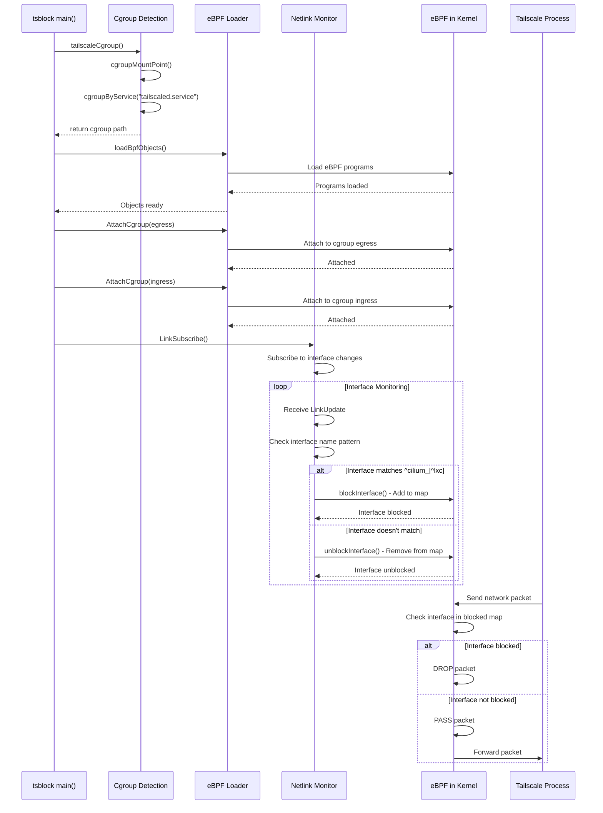

# tsblock

[](LICENSE)
[](https://github.com/ciffelia/tsblock/actions/workflows/ci.yaml)

tsblock prevents Tailscale from using specific network interfaces.

tsblock is developed to work around [tailscale/tailscale#7594](https://github.com/tailscale/tailscale/issues/7594). Currently, interfaces whose name matches `^vxlan\.calico$|^cali` are blocked. The pattern is hard-coded in [main.go](main.go).

## Requirements

- Tailscale must be running as a systemd service.
- tsblock must run as root. It is recommended to run tsblock as a systemd service.

## How it works

tsblock utilizes eBPF to drop packets sent from `tailscaled.service` systemd unit.

## Install

```
go build
sudo ./systemd/install.sh
sudo systemctl daemon-reload
sudo systemctl enable --now tsblock.service
```

## Uninstall

```
sudo systemctl disable --now tsblock.service
sudo ./systemd/uninstall.sh
```

## Architecture

### System Architecture



### Component Interaction


